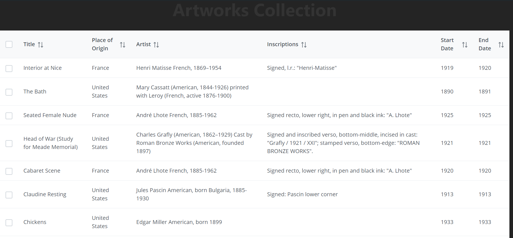

# Artworks Explorer

A web application built with React and TypeScript using PrimeReact DataTable. This application allows users to explore artworks from the Art Institute of Chicago API with features like pagination, row selection, and persistence of selected rows across pages.

## Features

- **PrimeReact DataTable**: Display artworks data in a clean and sortable table.
- **Server-Side Pagination**: Fetch artworks data page by page from the API.
- **Row Selection Persistence**: Selected rows are persisted even when navigating between pages.
- **Checkbox Selection**: Select individual rows or all rows on the page with a custom selection panel.
- **Responsive Design**: Built with responsiveness in mind for optimal viewing across devices.

## Technologies Used

- **Vite**: Fast React project bundler
- **React (TypeScript)**: Front-end framework
- **PrimeReact**: UI components for the table
- **Axios**: HTTP client for fetching API data
- **API**: Artworks data from [Art Institute of Chicago API](https://api.artic.edu/api/v1/artworks)

## Screenshots


*Screenshot of the Artworks Explorer in action*

## Getting Started

### Prerequisites

- **Node.js** and **npm** installed

### Installation

1. Clone the repository:

   ```bash
   git clone https://github.com/pushkarraj7/Artworks-Explorer.git


### **Key Sections of the README**:
1. **Project Description**: A clear and concise summary of the project and its features.
2. **Technologies Used**: A list of the key technologies and libraries used in the project.
3. **Getting Started**: Instructions to clone, install, and run the project locally.
4. **Build & Deployment**: Instructions on how to build and deploy the project for production.
5. **API Details**: Information about the API used for fetching artworks data.
6. **Contribution and License**: For encouraging contributions and stating the project license.

Feel free to customize the `README.md` based on your needs!
